# Fitness Tracker API

This project is a simple CRUD backend for managing fitness tracker data using **Python**, **FastAPI**, and **PostgreSQL**.

## Features

- REST API for Create, Read, Update, and Delete tracker records
- Bulk CSV loader to import fitness tracker data
- Dockerized PostgreSQL database for easy setup
- Clean test automation with `pytest`

## Quick Start

### 1. Install Python dependencies

pip install -r requirements.txt

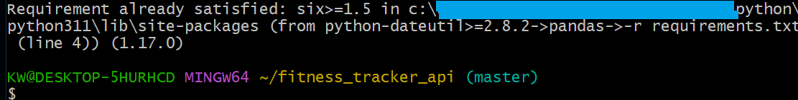
------------------------------------------------------------------

### 2. Start PostgreSQL using Docker

docker-compose up -d

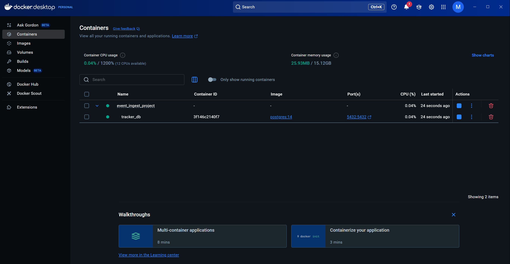  
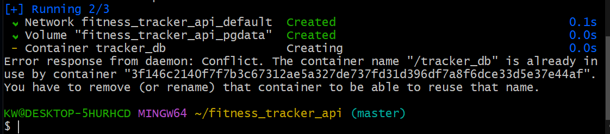

------------------------------------------------------------------

### 3. Run the FastAPI app

uvicorn app.main:app --reload

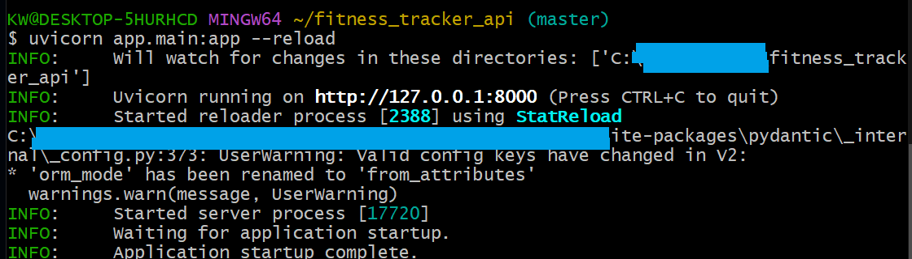  
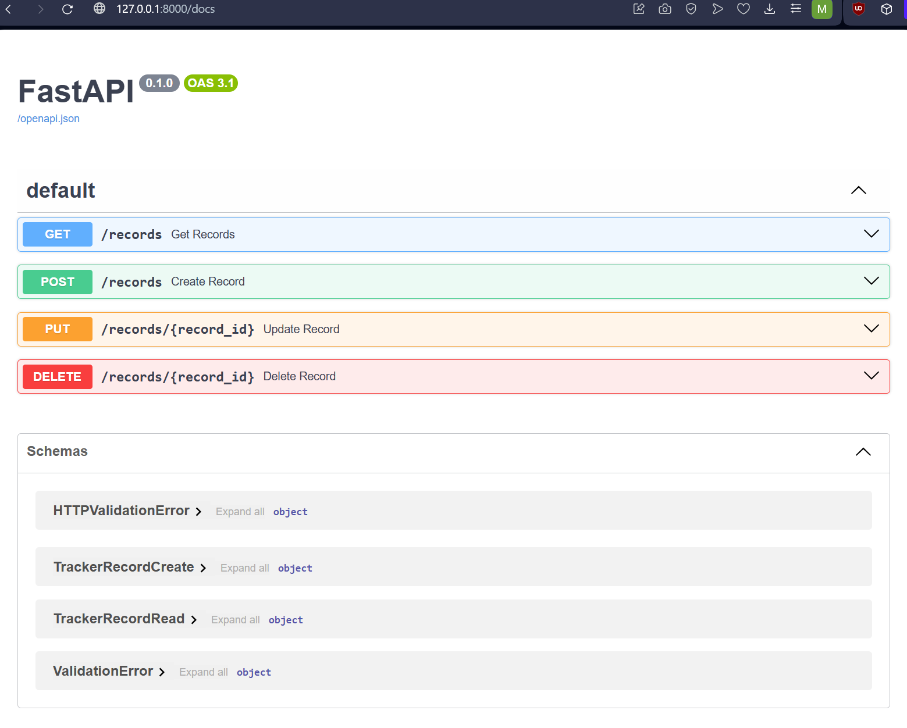  
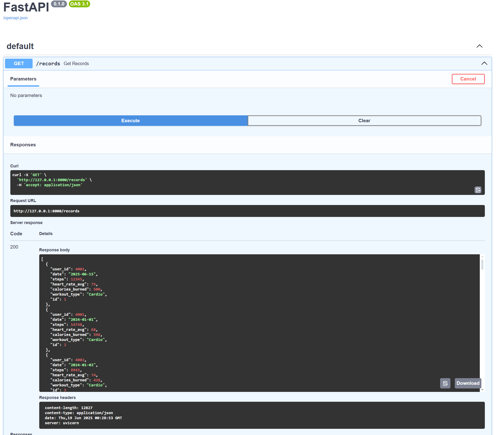  
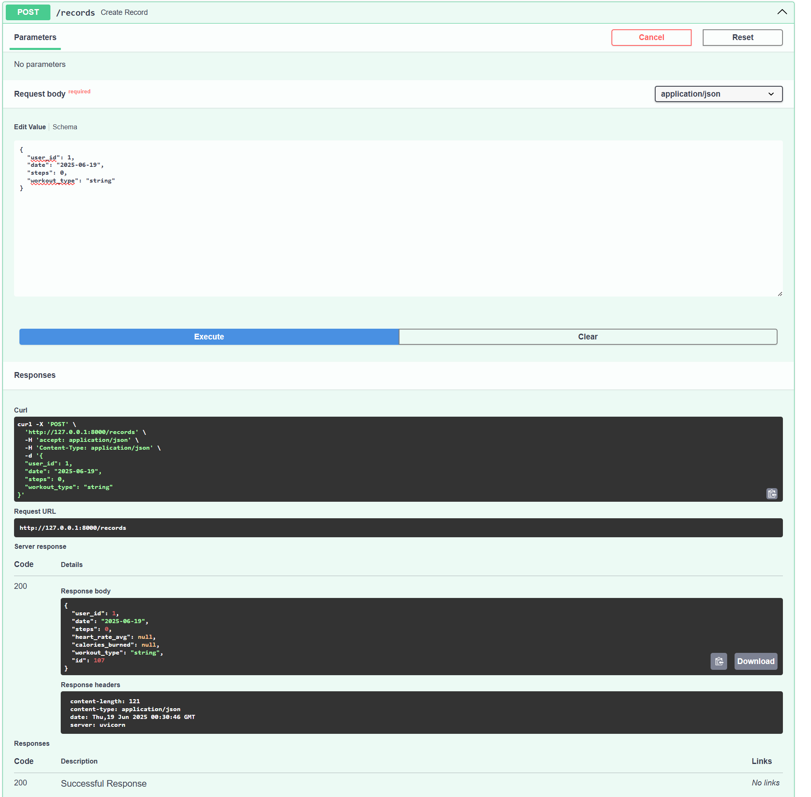  
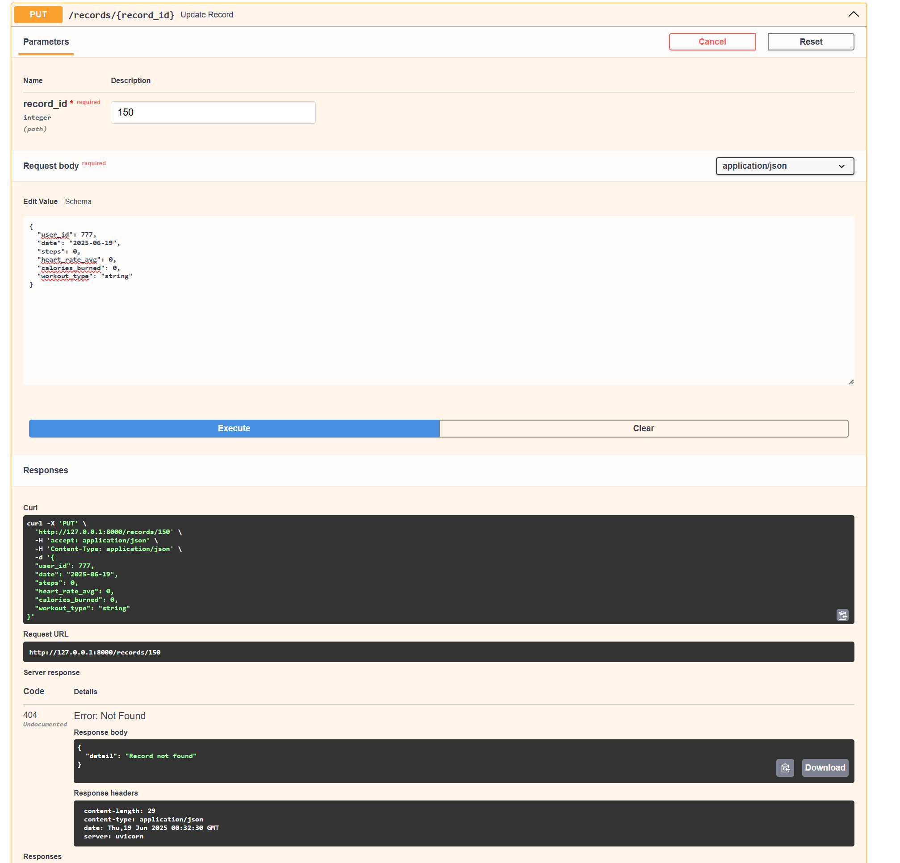  
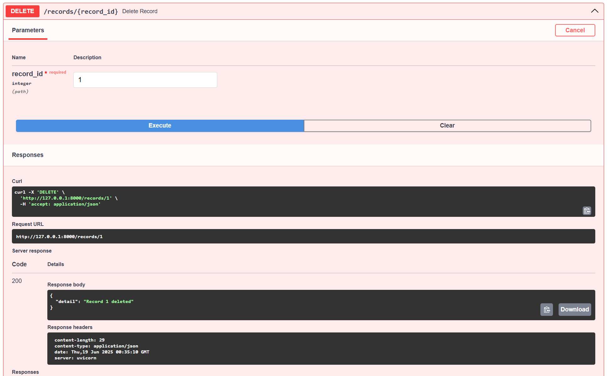  
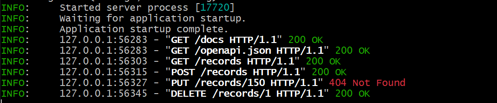

Open your browser: [http://127.0.0.1:8000/docs](http://127.0.0.1:8000/docs)  
Test all endpoints interactively.

------------------------------------------------------------------

### 4. Bulk load the CSV data

python load_csv.py

------------------------------------------------------------------

### 5. Run API tests

pytest tests/

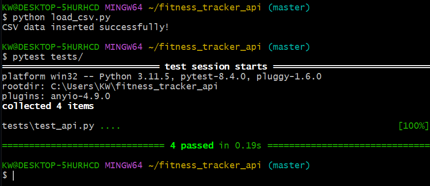
------------------------------------------------------------------
## 📂 Project Structure

fitness_tracker_api/  
 ├── app/  
 │   ├── db.py  
 │   ├── models.py  
 │   ├── schemas.py  
 │   ├── main.py  
 ├── data/  
 │   └── Fitness_Tracker_Data.csv  
 ├── tests/  
 │   └── test_api.py  
 ├── docker-compose.yml  
 ├── load_csv.py  
 ├── requirements.txt  
 ├── .env.example  
 ├── .gitignore  
 ├── README.md  
 └── images/  
      ├── 01-install-dependencies.png  
      ├── 02a-docker-desktop.png  
      ├── 02b-docker-compose.png  
      ├── 03a-uvicorn-run.png  
      ├── 03b-uvicorn-main.png  
      ├── 03c-GET-uvicorn-main.png  
      ├── 03c-POST-2rows-removed-uvicorn-main.png  
      ├── 03d-PUT-record_id-150-user_id-777-not-in-db-uvicorn-main.png  
      ├── 03e-DELETE-record_id-1-uvicorn-main.png  
      ├── 03f-FINAL-uvicorn-main.png  
      ├── 04-05-load-csv-pytest.png

## Notes

This project does **not** use a real AWS SQS queue yet — it focuses on core CRUD and CSV ingestion.  
Easily extendable to real event-driven queues in production.